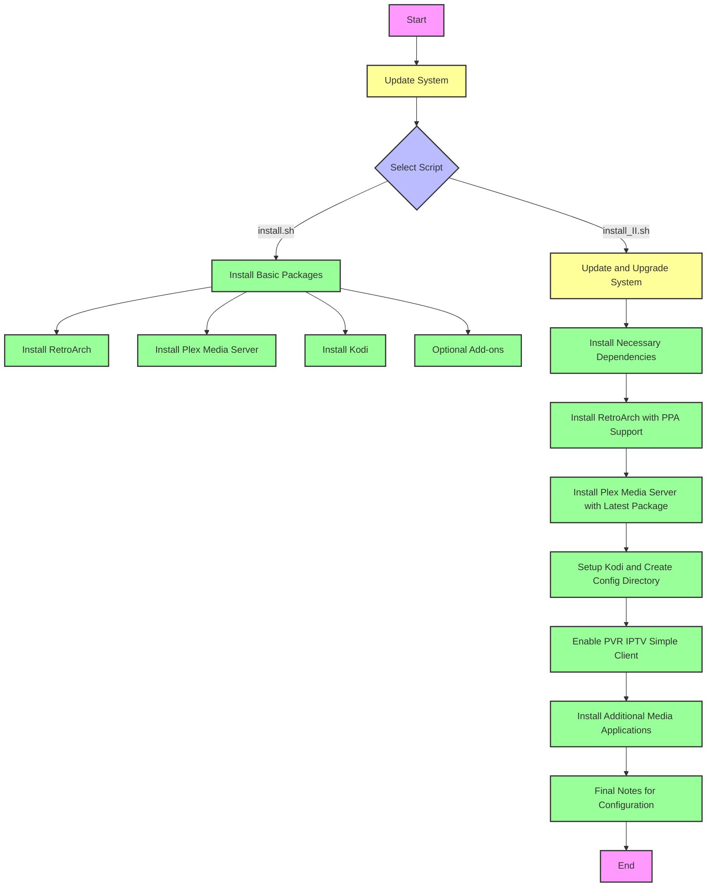

Absolutely! Here’s an **engaging, visually rich** version of your `README.md` using carefully chosen emojis, sub-headings, tips, and call-outs for extra clarity and energy:

---

# 🎬 Linux Entertainment Auto


Welcome to **Linux Entertainment Auto** — your one-stop, hassle-free solution for automating the configuration and installation of your favorite **media applications** like **Kodi**, **Plex Media Server**, **RetroArch**, and more!  
Easily transform any Linux box into a modern media powerhouse with just a few command lines. 🚀

---

## 📁 What’s Inside?

### 1. `install.sh` &ensp; 🔧

Your all-in-one script to:

- 🆙 **Update Your System:** Keep your Linux fresh with automatic updates and upgrades.
- 🛠️ **Install Essential Packages:** Grab all the basics for a seamless setup.
- 🎮 **RetroArch:** Dive into classic gaming in just minutes.
- 📺 **Plex Media Server:** Organize and stream your media across every screen.
- 📺 **Kodi:** Experience the ultimate open-source media center.
- 🌱 **Extra Goodies:** Get optional enhancements for an even richer entertainment setup.

---

### 2. `install_II.sh` &ensp; 🌟

Go beyond the basics! This powerful script includes everything from `install.sh` — **plus**:

- 🔄 **Double-check System Updates** for the latest security and features.
- 💼 **Install Dependencies**: (like `apt-transport-https`, `ca-certificates`, & more)
- 🔗 **RetroArch via PPA**: Uses **libretro PPA** for the latest-and-greatest release.
- ⚡ **Plex Media Server**:
  - Automatically fetches the newest `.deb` from Plex's API.
  - Installs and activates the Plex service—all hands-free!
- 🎠 **Kodi Expanded:**
  - Adds **PVR IPTV Simple Client** for live TV capabilities.
- 🎵 **Media App Collection:**
  - Installs top picks like **Strawberry**, **Lollypop**, **SMPlayer**, **Audacious**, **VLC**, etc.
- 📝 **Final Tips**: Wraps things up with pointers for manual tweaks and configuration.

---
---

---
## 🚦 Getting Started

No more copy-pasting dozens of commands!  
Just follow these simple instructions and get watching, listening, and gaming in minutes:

### 1. Clone the Repo

```bash
git clone https://github.com/elithaxxor/linux-entertainment-auto.git
cd linux-entertainment-auto
```

### 2. Make Scripts Executable & Launch

```bash
chmod +x install.sh
./install.sh
```

**OR** try the advanced version:

```bash
chmod +x install_II.sh
./install_II.sh
```

### 3. Finish Up

- Follow the on-screen prompts.
- Configure each app as needed for your preferences.

---

## ☑️ Prerequisites

Before you run the scripts, make sure you have:

- 🐧 A Linux system with `apt` (Ubuntu, Debian, Mint, Pop!_OS, etc.)
- 💻 Basic terminal skills.
- 🌐 An internet connection.

---
